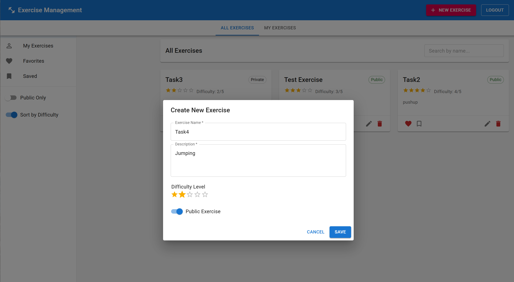

# Exercise Management API

This project was developed using Cursor AI, powered by Claude-3.5-Sonnet. As the author, I guided the AI by selecting the technologies, designing the data models, and directing the implementation. The development process took approximately 4 hours with AI assistance, demonstrating the potential of human-AI collaboration in modern software development.

A RESTful API for managing exercises built with:
- Python 3.11
- FastAPI
- PostgreSQL
- Redis
- JWT Authentication

## Features
- Exercise management (create, read, update, delete)
- Public/private exercise visibility
- Search, filter, and sort exercises by difficulty
- Social features (favorite, save, rate exercises)
- Automatic database migrations
- Multi-column database indexing (name, description, difficulty_level) for optimized search

## Requirements
- Docker and Docker Compose
- Node.js/npm (for frontend development)

## Running the Backend
```bash
docker compose up --build
```

The server will start at `http://localhost:8000`

## Running the Frontend (Development Mode)
The frontend is developed separately from the backend to enable faster development:

```bash
# From the project root
cd frontend
npm install
npm start
```

The frontend will be available at `http://localhost:3000` and will automatically proxy API requests to the backend running on port 8000.

## Database Migrations
Migrations are handled automatically on startup, but you can also run them manually:
```bash
# Apply all migrations
docker compose exec web alembic upgrade head

# Rollback last migration
docker compose exec web alembic downgrade -1

# Create a new migration after model changes
docker compose exec web alembic revision --autogenerate -m "description"
```

## API Documentation
Once the application is running, access the API documentation at:
- Swagger UI: `http://localhost:8000/docs`
- ReDoc: `http://localhost:8000/redoc`

## Running Tests
```bash
docker compose exec web pytest -v
```

## User Interface

The application features a clean, modern UI built with React and Material-UI.

### Login


### Signup


### Exercise Landing Page


### Add New Exercise


